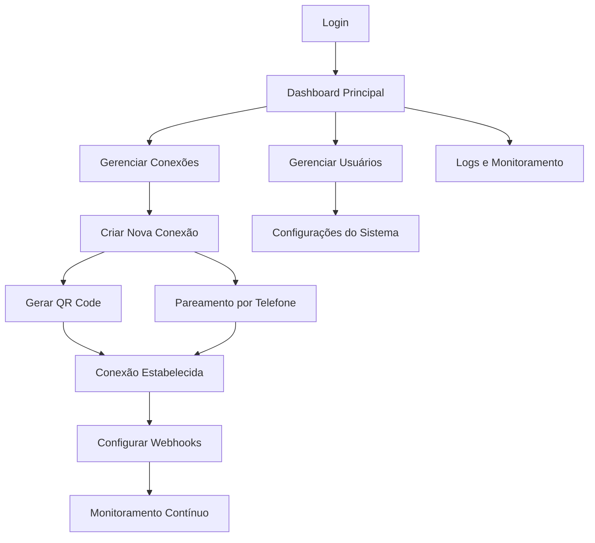

# WhatsApp Connection Manager - Documento de Requisitos do Produto

## 1. Visão Geral do Produto

O WhatsApp Connection Manager é uma plataforma web completa para gerenciar múltiplas conexões WhatsApp através das APIs WUZAPI e Evolution API. O sistema permite criar, monitorar e administrar conexões WhatsApp de forma centralizada, oferecendo funcionalidades avançadas de gerenciamento de usuários, webhooks e monitoramento em tempo real.

O produto resolve a necessidade de empresas e desenvolvedores que precisam gerenciar múltiplas instâncias WhatsApp de forma eficiente, proporcionando uma interface intuitiva para controle total das conexões e integração com sistemas externos através de webhooks.

## 2. Funcionalidades Principais

### 2.1 Papéis de Usuário

| Papel | Método de Registro | Permissões Principais |
|-------|-------------------|----------------------|
| Administrador | Criação manual pelo sistema | Acesso completo: gerenciar usuários, configurações globais, logs do sistema |
| Gerente | Convite por administrador | Gerenciar conexões, usuários da equipe, configurar webhooks |
| Operador | Convite por gerente/admin | Criar conexões, monitorar status, visualizar logs básicos |
| Visualizador | Convite por qualquer papel superior | Apenas visualizar status das conexões e relatórios |

### 2.2 Módulos de Funcionalidade

Nossa plataforma de gerenciamento WhatsApp consiste nas seguintes páginas principais:

1. **Dashboard Principal**: visão geral das conexões, métricas em tempo real, alertas e notificações
2. **Gerenciamento de Conexões**: lista de conexões, criação de novas instâncias, controle de status
3. **Página de Conexão**: geração de QR code, pareamento por telefone, processo de autenticação
4. **Gerenciamento de Usuários**: CRUD de usuários, controle de permissões, histórico de atividades
5. **Configuração de Webhooks**: configurar endpoints, testar conexões, logs de webhooks
6. **Logs e Monitoramento**: histórico detalhado, filtros avançados, exportação de dados
7. **Configurações do Sistema**: configurações globais, integrações, backup e restauração

### 2.3 Detalhes das Páginas

| Nome da Página | Nome do Módulo | Descrição da Funcionalidade |
|----------------|----------------|----------------------------|
| Dashboard Principal | Visão Geral | Exibir métricas em tempo real, status das conexões ativas, alertas de desconexão, gráficos de atividade |
| Dashboard Principal | Notificações | Sistema de alertas push, histórico de notificações, configuração de preferências |
| Gerenciamento de Conexões | Lista de Conexões | Visualizar todas as conexões, filtrar por status, ações em lote (conectar/desconectar) |
| Gerenciamento de Conexões | Criação de Instância | Formulário para criar nova conexão, validação de dados, configurações iniciais |
| Página de Conexão | Geração QR Code | Gerar e exibir QR code, atualização automática, instruções de uso |
| Página de Conexão | Pareamento por Telefone | Solicitar código de pareamento, validar código, processo alternativo ao QR |
| Página de Conexão | Status da Conexão | Monitorar processo de conexão, feedback visual, tratamento de erros |
| Gerenciamento de Usuários | CRUD Usuários | Criar, editar, excluir usuários, definir permissões, resetar senhas |
| Gerenciamento de Usuários | Controle de Acesso | Gerenciar tokens de acesso, sessões ativas, auditoria de login |
| Configuração de Webhooks | Gerenciar Webhooks | Criar, editar, excluir webhooks, testar conectividade, configurar eventos |
| Configuração de Webhooks | Logs de Webhook | Visualizar tentativas de entrega, status de resposta, reenvio manual |
| Logs e Monitoramento | Histórico de Atividades | Logs detalhados de todas as ações, filtros por usuário/data/tipo |
| Logs e Monitoramento | Relatórios | Gerar relatórios de uso, exportar dados, análise de performance |
| Configurações do Sistema | Configurações Globais | Configurar timeouts, limites de conexão, configurações de segurança |
| Configurações do Sistema | Integrações | Configurar APIs externas, Chatwoot, S3, proxy settings |

## 3. Processo Principal

### Fluxo do Administrador
1. Acessa o dashboard e visualiza o status geral do sistema
2. Gerencia usuários e define permissões
3. Configura webhooks globais e integrações
4. Monitora logs do sistema e performance
5. Realiza backup e manutenção do sistema

### Fluxo do Operador
1. Acessa o dashboard e visualiza suas conexões
2. Cria nova conexão WhatsApp
3. Gera QR code ou solicita pareamento por telefone
4. Escaneia QR code no WhatsApp ou insere código de pareamento
5. Monitora status da conexão e configura webhooks específicos
6. Visualiza logs e relatórios de suas conexões

## 4. Design da Interface do Usuário

### 4.1 Estilo de Design

- **Cores Primárias**: #25D366 (Verde WhatsApp), #128C7E (Verde escuro)
- **Cores Secundárias**: #34495E (Azul escuro), #ECF0F1 (Cinza claro)
- **Estilo dos Botões**: Arredondados com sombra sutil, efeito hover suave
- **Fonte**: Inter ou Roboto, tamanhos 14px (corpo), 16px (títulos), 24px (cabeçalhos)
- **Layout**: Design baseado em cards, navegação lateral fixa, breadcrumbs
- **Ícones**: Feather Icons ou Heroicons, estilo outline para consistência

### 4.2 Visão Geral do Design das Páginas

| Nome da Página | Nome do Módulo | Elementos da UI |
|----------------|----------------|-----------------|
| Dashboard Principal | Visão Geral | Cards de métricas com ícones, gráficos em tempo real, tabela de conexões recentes, indicadores de status coloridos |
| Dashboard Principal | Notificações | Toast notifications, badge de contadores, modal de detalhes, botões de ação rápida |
| Gerenciamento de Conexões | Lista de Conexões | Tabela responsiva, filtros dropdown, botões de ação em linha, modal de confirmação |
| Página de Conexão | Geração QR Code | QR code centralizado, botão de refresh, timer de expiração, instruções passo-a-passo |
| Gerenciamento de Usuários | CRUD Usuários | Formulário modal, tabela com paginação, badges de status, dropdown de ações |
| Configuração de Webhooks | Gerenciar Webhooks | Formulário de configuração, teste de conectividade, logs em tempo real |
| Logs e Monitoramento | Histórico | Tabela com scroll infinito, filtros avançados, export buttons, syntax highlighting |

### 4.3 Responsividade

O sistema é desktop-first com adaptação mobile completa. Inclui navegação colapsável em dispositivos móveis, cards empilháveis, e otimização para touch interaction em tablets e smartphones.
