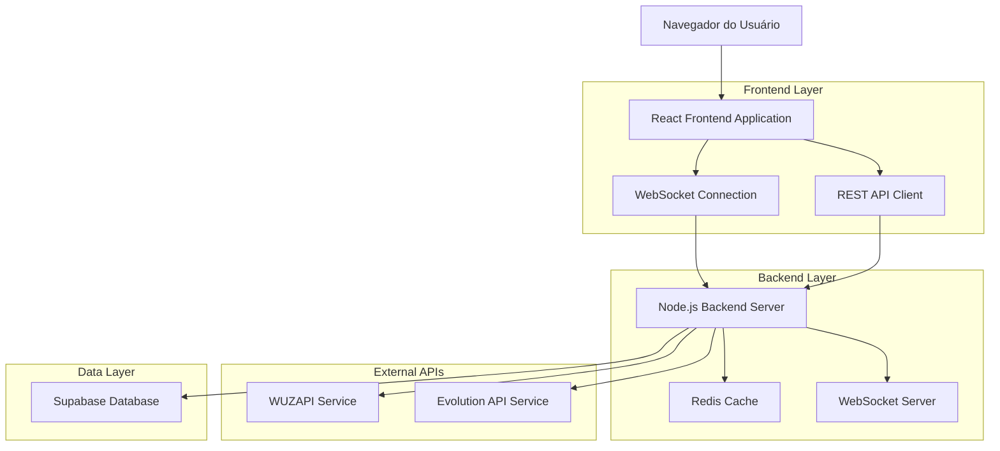
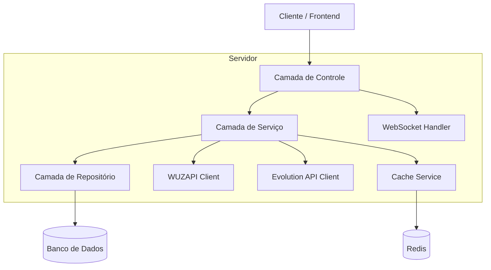
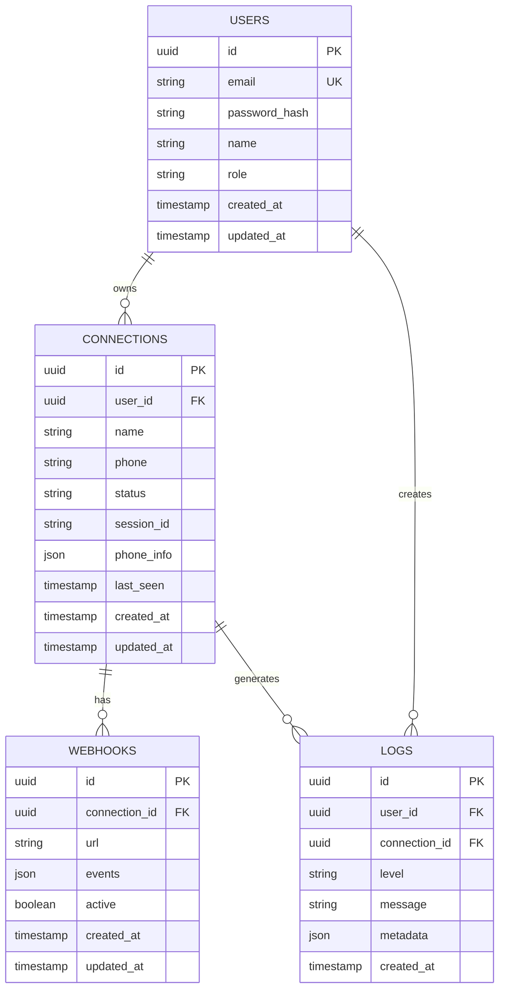

# WhatsApp Connection Manager - Arquitetura Técnica

## 1. Design da Arquitetura



## 2. Descrição das Tecnologias

- Frontend: React@18 + TypeScript + Tailwind CSS + Vite + Socket.io-client
- Backend: Node.js@18 + Express@4 + TypeScript + Socket.io + Redis
- Database: Supabase (PostgreSQL)
- Cache: Redis@7
- APIs Externas: WUZAPI, Evolution API

## 3. Definições de Rotas

| Rota | Propósito |
|------|-----------|
| / | Página de login e autenticação |
| /dashboard | Dashboard principal com visão geral das conexões |
| /connections | Gerenciamento de conexões WhatsApp |
| /connections/new | Criar nova conexão |
| /connections/:id/connect | Página de conexão com QR code/pareamento |
| /users | Gerenciamento de usuários (admin) |
| /webhooks | Configuração de webhooks |
| /logs | Logs e monitoramento do sistema |
| /settings | Configurações globais do sistema |
| /profile | Perfil do usuário logado |

## 4. Definições de API

### 4.1 APIs Principais

**Autenticação de Usuários**
```
POST /api/auth/login
```

Request:
| Nome do Parâmetro | Tipo | Obrigatório | Descrição |
|-------------------|------|-------------|-----------|
| email | string | true | Email do usuário |
| password | string | true | Senha do usuário |

Response:
| Nome do Parâmetro | Tipo | Descrição |
|-------------------|------|-----------|
| success | boolean | Status da autenticação |
| token | string | JWT token para autenticação |
| user | object | Dados do usuário |

**Gerenciamento de Conexões**
```
GET /api/connections
```

Response:
| Nome do Parâmetro | Tipo | Descrição |
|-------------------|------|-----------|
| connections | array | Lista de conexões do usuário |
| total | number | Total de conexões |

```
POST /api/connections
```

Request:
| Nome do Parâmetro | Tipo | Obrigatório | Descrição |
|-------------------|------|-------------|-----------|
| name | string | true | Nome da conexão |
| phone | string | true | Número de telefone (sem +) |
| webhook_url | string | false | URL do webhook |

**Controle de Sessão WhatsApp**
```
POST /api/connections/:id/connect
```

Request:
| Nome do Parâmetro | Tipo | Obrigatório | Descrição |
|-------------------|------|-------------|-----------|
| method | string | true | "qr" ou "phone" |

Response:
| Nome do Parâmetro | Tipo | Descrição |
|-------------------|------|-----------|
| qr_code | string | Base64 do QR code (se method=qr) |
| pair_code | string | Código de pareamento (se method=phone) |
| session_id | string | ID da sessão |

**Status da Conexão**
```
GET /api/connections/:id/status
```

Response:
| Nome do Parâmetro | Tipo | Descrição |
|-------------------|------|-----------|
| status | string | "connected", "disconnected", "connecting" |
| last_seen | string | Última atividade |
| phone_info | object | Informações do telefone conectado |

**Gerenciamento de Webhooks**
```
POST /api/webhooks
```

Request:
| Nome do Parâmetro | Tipo | Obrigatório | Descrição |
|-------------------|------|-------------|-----------|
| url | string | true | URL do webhook |
| events | array | true | Lista de eventos a escutar |
| connection_id | string | true | ID da conexão |

**Logs do Sistema**
```
GET /api/logs
```

Request:
| Nome do Parâmetro | Tipo | Obrigatório | Descrição |
|-------------------|------|-------------|-----------|
| level | string | false | Nível do log (info, warn, error) |
| start_date | string | false | Data inicial (ISO) |
| end_date | string | false | Data final (ISO) |
| connection_id | string | false | Filtrar por conexão |

Exemplo de Request:
```json
{
  "name": "Conexão Vendas",
  "phone": "5511999999999",
  "webhook_url": "https://meusite.com/webhook"
}
```

## 5. Diagrama da Arquitetura do Servidor



## 6. Modelo de Dados

### 6.1 Definição do Modelo de Dados



### 6.2 Linguagem de Definição de Dados

**Tabela de Usuários (users)**
```sql
-- criar tabela
CREATE TABLE users (
    id UUID PRIMARY KEY DEFAULT gen_random_uuid(),
    email VARCHAR(255) UNIQUE NOT NULL,
    password_hash VARCHAR(255) NOT NULL,
    name VARCHAR(100) NOT NULL,
    role VARCHAR(20) DEFAULT 'operator' CHECK (role IN ('admin', 'manager', 'operator', 'viewer')),
    created_at TIMESTAMP WITH TIME ZONE DEFAULT NOW(),
    updated_at TIMESTAMP WITH TIME ZONE DEFAULT NOW()
);

-- criar índices
CREATE INDEX idx_users_email ON users(email);
CREATE INDEX idx_users_role ON users(role);

-- permissões Supabase
GRANT SELECT ON users TO anon;
GRANT ALL PRIVILEGES ON users TO authenticated;
```

**Tabela de Conexões (connections)**
```sql
-- criar tabela
CREATE TABLE connections (
    id UUID PRIMARY KEY DEFAULT gen_random_uuid(),
    user_id UUID REFERENCES users(id) ON DELETE CASCADE,
    name VARCHAR(100) NOT NULL,
    phone VARCHAR(20) NOT NULL,
    status VARCHAR(20) DEFAULT 'disconnected' CHECK (status IN ('connected', 'disconnected', 'connecting', 'error')),
    session_id VARCHAR(255),
    phone_info JSONB,
    last_seen TIMESTAMP WITH TIME ZONE,
    created_at TIMESTAMP WITH TIME ZONE DEFAULT NOW(),
    updated_at TIMESTAMP WITH TIME ZONE DEFAULT NOW()
);

-- criar índices
CREATE INDEX idx_connections_user_id ON connections(user_id);
CREATE INDEX idx_connections_status ON connections(status);
CREATE INDEX idx_connections_phone ON connections(phone);

-- permissões Supabase
GRANT SELECT ON connections TO anon;
GRANT ALL PRIVILEGES ON connections TO authenticated;
```

**Tabela de Webhooks (webhooks)**
```sql
-- criar tabela
CREATE TABLE webhooks (
    id UUID PRIMARY KEY DEFAULT gen_random_uuid(),
    connection_id UUID REFERENCES connections(id) ON DELETE CASCADE,
    url VARCHAR(500) NOT NULL,
    events JSONB NOT NULL DEFAULT '[]',
    active BOOLEAN DEFAULT true,
    created_at TIMESTAMP WITH TIME ZONE DEFAULT NOW(),
    updated_at TIMESTAMP WITH TIME ZONE DEFAULT NOW()
);

-- criar índices
CREATE INDEX idx_webhooks_connection_id ON webhooks(connection_id);
CREATE INDEX idx_webhooks_active ON webhooks(active);

-- permissões Supabase
GRANT SELECT ON webhooks TO anon;
GRANT ALL PRIVILEGES ON webhooks TO authenticated;
```

**Tabela de Logs (logs)**
```sql
-- criar tabela
CREATE TABLE logs (
    id UUID PRIMARY KEY DEFAULT gen_random_uuid(),
    user_id UUID REFERENCES users(id) ON DELETE SET NULL,
    connection_id UUID REFERENCES connections(id) ON DELETE SET NULL,
    level VARCHAR(10) NOT NULL CHECK (level IN ('info', 'warn', 'error', 'debug')),
    message TEXT NOT NULL,
    metadata JSONB DEFAULT '{}',
    created_at TIMESTAMP WITH TIME ZONE DEFAULT NOW()
);

-- criar índices
CREATE INDEX idx_logs_user_id ON logs(user_id);
CREATE INDEX idx_logs_connection_id ON logs(connection_id);
CREATE INDEX idx_logs_level ON logs(level);
CREATE INDEX idx_logs_created_at ON logs(created_at DESC);

-- permissões Supabase
GRANT SELECT ON logs TO anon;
GRANT ALL PRIVILEGES ON logs TO authenticated;

-- dados iniciais
INSERT INTO users (email, password_hash, name, role) VALUES 
('admin@whatsapp-manager.com', '$2b$10$example_hash', 'Administrador', 'admin');
```